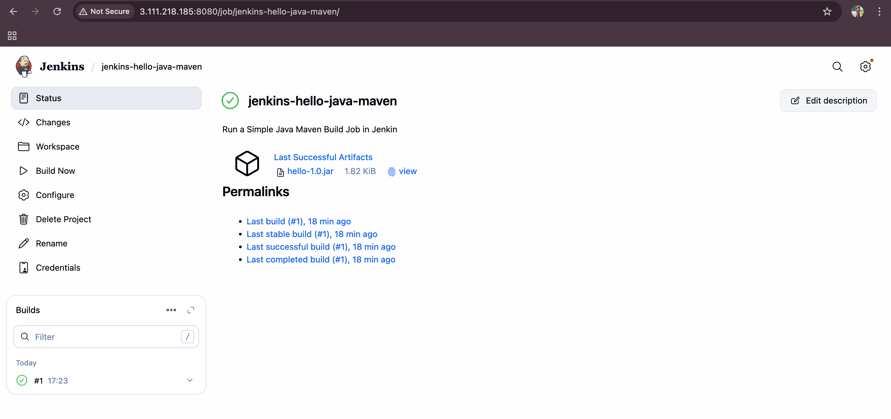
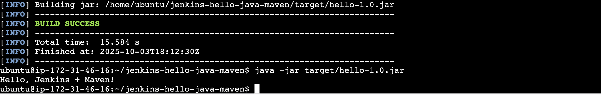

# Jenkins Hello Java Maven 🚀

This project demonstrates a **basic Java HelloWorld application** built using **Maven** and deployed on **Jenkins**.  
It’s part of a CI/CD learning task to understand how Jenkins integrates with build tools like Maven.

---

## 📖 Project Overview
- A simple Java `HelloWorld` program (`HelloWorld.java`)
- A `pom.xml` file for Maven build configuration
- A Jenkins **Freestyle Job** configured to run `mvn clean package`
- Jenkins console output screenshot proving **BUILD SUCCESS**
- Final artifact: `hello-1.0.jar`

---

## 🛠️ Tools Used
- **AWS EC2 (Ubuntu 22.04)** – Jenkins host  
- **Jenkins (LTS)** – Automation server  
- **Maven 3.8.x** – Build tool  
- **Java JDK 8/11** – Compiler/runtime  
- **GitHub** – Source code repository  

---

## 📂 Project Structure

jenkins-hello-java-maven/
├── src/
│ └── main/
│ └── java/
│ └── HelloWorld.java
├── pom.xml
├── README.md
└── jenkins-build-success.png # Screenshot of Jenkins console output


---

## 🚀 Setup & Run Locally

### 1️⃣ Clone the repo
```bash
git clone https://github.com/Kshitija-0710/jenkins-hello-java-maven.git
cd jenkins-hello-java-maven

### 2️⃣ Build with Maven
mvn clean package

Expected output:

[INFO] BUILD SUCCESS


The compiled JAR will be inside:

target/hello-1.0.jar

### 3️⃣ Run the program
java -cp target/hello-1.0.jar HelloWorld


Expected output:

Hello, Jenkins + Maven!

## 📸 Jenkins Build Screenshot
Successful Jenkins build log:





## 📥 Download Artifact

You can directly download the built JAR from this repository:
👉 Download hello-1.0.jar

## 📌 What I Learned

How to install & configure Jenkins on AWS EC2

Adding Maven in Jenkins Global Tool Configuration

Creating a Freestyle Job linked to GitHub repo

Running Maven build (mvn clean package) via Jenkins

Checking Jenkins console logs for BUILD SUCCESS

## 💡 Interview Prep Q&A

1. What is Jenkins?
Jenkins is an open-source automation server used for CI/CD, automating build, test, and deployment.

2. How do you create a Jenkins job?
From Jenkins dashboard → New Item → choose job type (Freestyle or Pipeline) → configure SCM, build steps, and post-build actions.

3. What is Maven used for?
Maven is a build automation and dependency management tool for Java projects.

4. How does Jenkins use Maven?
Jenkins invokes Maven goals like clean, compile, package inside job workspaces to build and package code.

5. Difference between compile and package in Maven?

compile: Converts .java files into .class bytecode.

package: Packages compiled code into JAR/WAR for distribution.

6. Where do you configure tools in Jenkins?
Manage Jenkins → Global Tool Configuration (Maven, JDK, Git, etc.).

7. How do you debug a failed Jenkins build?
Check console logs, reproduce build locally with mvn clean package, check dependencies, fix environment/config issues.

##  📜 License

This project is licensed under the MIT License – feel free to use and modify.

